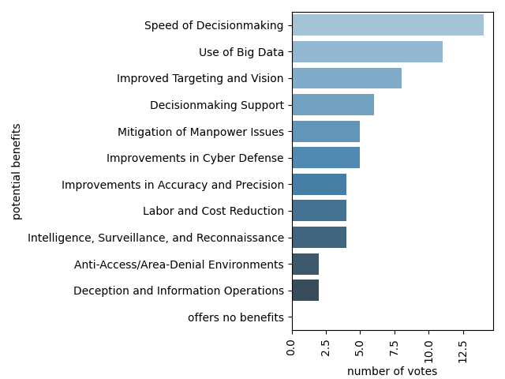

# AI & National Security : a literature review (supplementary material)  
this document explains the supplementary code accompanied with our report, the following is the structure of our code base :

```
|-- data #folder contains data exported from research papers
|   |-- benefits.json
|   |-- risks.json
|-- Makefile #contains recipes to reproduce figures  
|-- output
|   |-- figures
|       |-- military_benefits.png
|       |-- military_risks.png
|-- README.md 
|-- src
    |-- barplot.py #python scripts to generate bar-plots 
    |-- utils
        |-- utils.py #helper functions
```

## `src/utils/utils.py` contains  
```python
import json


def read_json(file):
    with open(file) as f:
        data = json.load(f)
    return data
```
script to read `.json` data files.


## `src/barplot.py` contains :
```python
    args = parse_args()
    data = read_json(args.input)
    # plot and save plot
    sns.barplot(y=list(data.keys()), x=list(data.values()),
                palette="Blues_d", orientation='horizontal')
    plt.xticks(rotation=90)
    plt.ylabel(args.xlabel)
    plt.xlabel(args.ylabel)
    plt.tight_layout()
    plt.savefig(args.output)
```
this script takes as argument parsed data inputed in the format of a `.json` file and plot figures similar to this :



## example of `.json` data used :

benefits of AI systems in military sector : 

```json
{
"Speed of Decisionmaking":14,
"Use of Big Data":11,
"Improved Targeting and Vision":8,
"Decisionmaking Support":6,
"Mitigation of Manpower Issues":5,
"Improvements in Cyber Defense":5,
"Improvements in Accuracy and Precision":4,
"Labor and Cost Reduction":4,
"Intelligence, Surveillance, and Reconnaissance":4,
"Anti-Access/Area-Denial Environments":2,
"Deception and Information Operations":2,
"offers no benefits":0
}
```